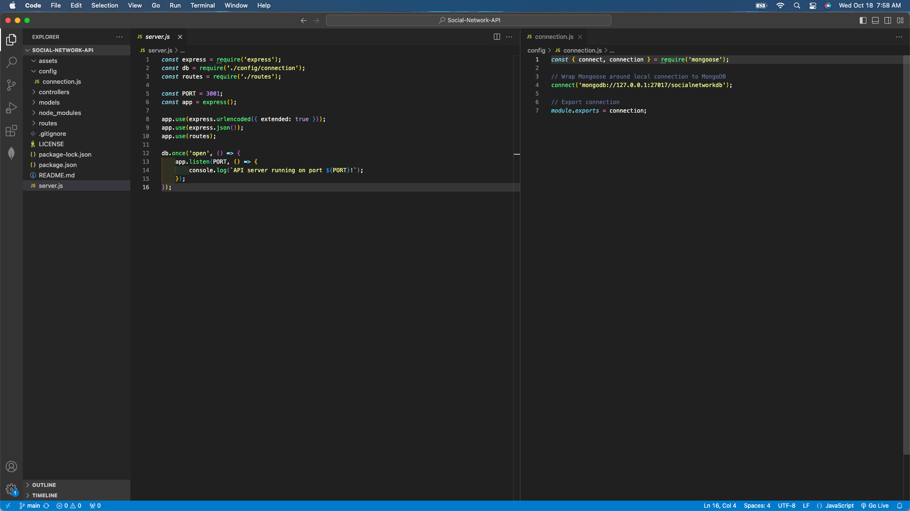
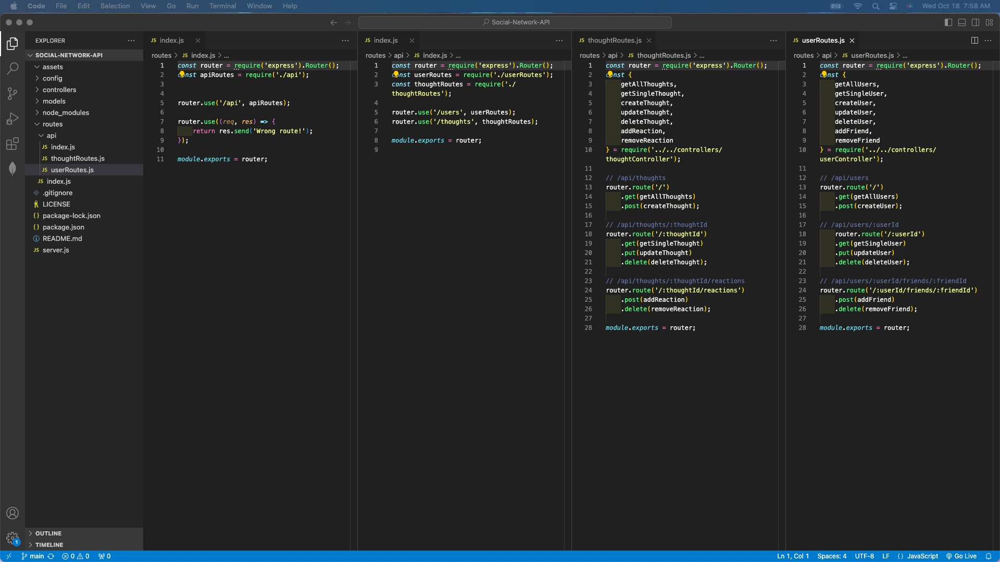
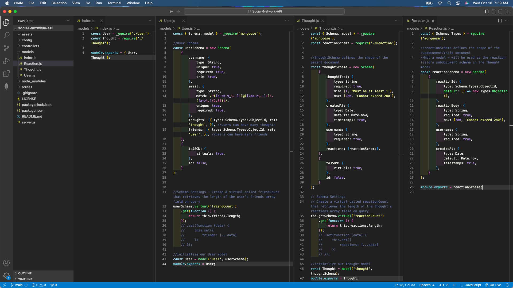
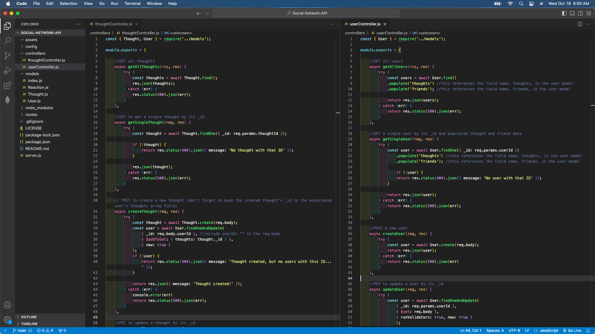
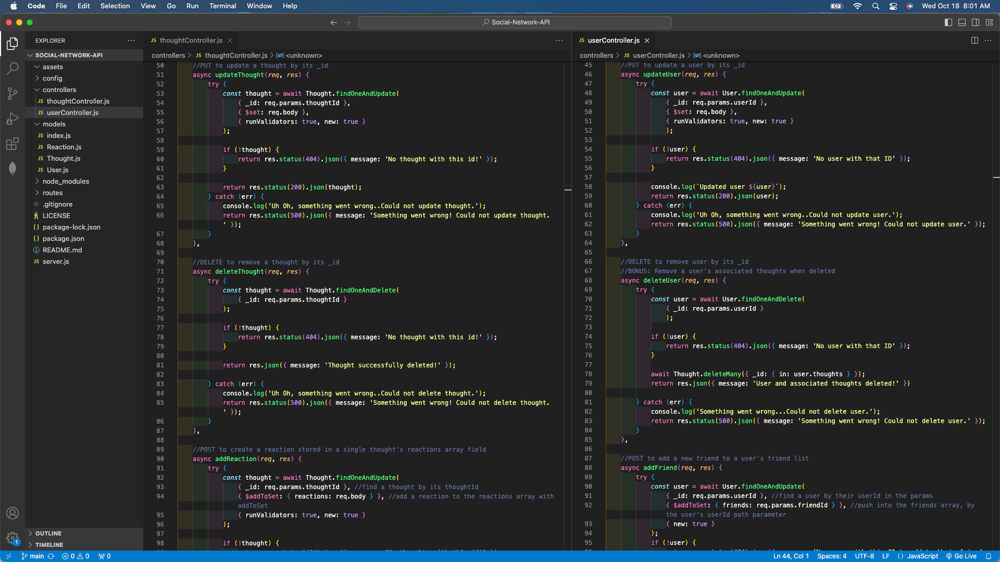
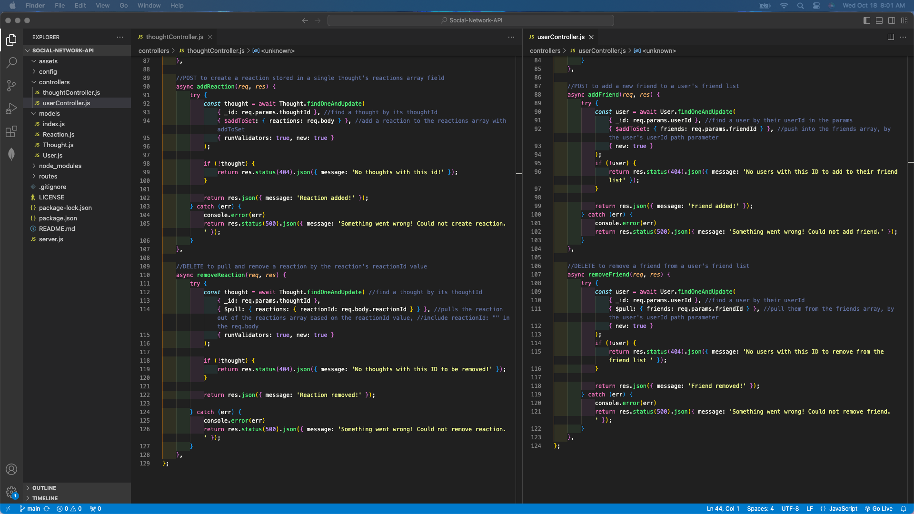

# Social-Network-API

## Table of Contents
- [Description](#description)
- [Installation](#installation)
- [Usage](#usage)
- [License](#license)
- [Contribution](#contribution)
- [Tests](#tests)
- [Questions](#questions)

## Description
The purpose of this project is to build an API for a social network web application where users can share their thoughts, react to friends’ thoughts, and create a friend list. View the application's functionality here: https://drive.google.com/file/d/197kZ45mBUmqM12JN_hLi1qhese3szY-A/view?usp=sharing.

## Installation
VS Code to code the back end of the application. GibHub for version control. Install Express (https://www.npmjs.com/package/express) and Mongoose (https://www.npmjs.com/package/mongoose). Download Insomnia to test the CRUD operations (GET, POST, PUT, and DELETE calls) in the VS code: https://insomnia.rest/download.

## Usage
This can be used when clients need a social network web application.

For a quick scan of the code to put together this application, view the following:

View a screenshot of the server and connection files in VS Code:

View a screenshot of the routes in VS Code:

View a screenshot of the models in VS Code:

View a screenshot of the model relations in VS Code:

View a screenshot of the GET, POST calls in VS Code:

View a screenshot of the POST, PUT, DELETE calls in VS Code:

## License
This project is under the MIT license.

## Contribution
The assignment provided instructions for setting up the database models and routes. The coding in the server.js file (imports, boilerplate middleware, port listener), the coding in the models files (set up its fields and rules), the coding in the index file (establishing the relations between models), and the coding in the controllers files (GET, POST, PUT, DELETE calls) using the MVC framework -all the additions- are credited to the curriculum taught in the UCI coding boot camp. AskBCS also provided assistance with the addFriend and removeReaction calls.

For validations, getters, setters, and GET/POST/PUT/DELETE call syntax: https://mongoosejs.com/docs/validation.html#the-unique-option-is-not-a-validator 
To complete the README with screenshots, the source for the code is: https://stackoverflow.com/questions/10189356/how-to-add-screenshot-to-readmes-in-github-repository.
To complete the README section, the source is: https://coding-boot-camp.github.io/full-stack/github/professional-readme-guide.
To complete the markdown for the README, the source is: https://www.markdownguide.org/basic-syntax/

## Tests
To test the functionality of the Social-Network-API, users can clone this repo, run ‘npm install’ in the command line, and start the application’s server with “node server” in the command line. View the video for the step-by-step set-up and for the Insomnia calls: https://drive.google.com/file/d/197kZ45mBUmqM12JN_hLi1qhese3szY-A/view?usp=sharing.
For Insomnia: Once the server is running, open Insomnia and make calls with the base domain http://localhost:3001, with the varying parameters in routes/api/index file. First create the data with the POST calls in order to then execute GET, PUT, and DELETE.

## Questions
The link to my Github Profile here: https://github.com/codeandlift706.
For any additional questions, please reach me at: channguyen715@gmail.com.
